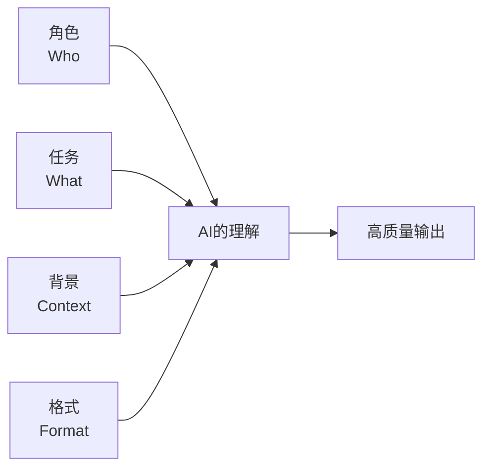
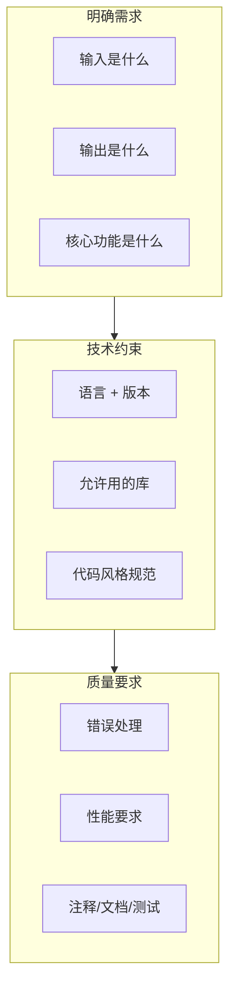

# 跟AI对话的正确姿势：提示词工程入门指南

> 本篇为Agent能力测试的结果, 内容由AI生成. 
> 
> 内容: 伊薇特Agent
> 
> 校对: 你
> 
> 写给普通人的AI沟通手册  
> 
> 版本：2026年6月

---

## 速览

- **核心要点**：先把 Who / What / Context / Format 说清楚；用 CO-STAR 组织复杂任务；对关键信息要求来源与格式（如 JSON Schema）。  
- **三步上手**：1) 明确角色与目标；2) 给出格式/长度/语气等约束并至少提供一个示例；3) 迭代输出并做校验（自动化或 LLM-as-Judge）。

---

## 写在前面

你有没有过这样的经历——

把同一个问题发给AI朋友，对方掏出了惊艳的答案；而自己收到的，却是一段"正确的废话"。

这不是AI偏心。而是因为——**AI不会读心术，它只看到你写了什么，没写什么。**

写提示词（Prompt），本质上就是学**怎么跟AI沟通**。就像你跟一个刚到公司、能力超强但完全不了解你背景的实习生下Brief——吩咐得越清楚，活儿干得越漂亮。

本指南不讲黑话，不搞玄学。每个技巧配一个"坏的 vs 好的"真实对比，读完立刻能用。

---

## 第一章：基础四要素 —— 让AI听懂你的起点

无论你用Claude、GPT还是DeepSeek，高质量提示词的底层结构都一样。把下面四个要素说清楚，输出质量至少翻倍。



### 要素一：角色（Who）—— 告诉AI它该扮演谁

AI的知识库里有"一万种人格"。你不指定，它就选最安全、最平庸的那个。

| | [差] | [好] |
|---|--------|--------|
| **写法** | "帮我写个方案" | "你是一个有10年经验的营销总监，负责过3个千万级新品上市" |
| **结果** | 泛泛而谈的模板 | 有策略、有数据思维的方案 |

**原理**：角色设定不是让AI"演戏"，而是缩小输出的搜索空间。当你说"后端架构师"，模型会自然考虑索引优化、外键约束、性能瓶颈——这些是架构师会关注的东西。

### 要素二：任务（What）—— 你到底想要什么

"模糊的指令 = 模糊的结果"，这是提示词工程的第一铁律。

| | [差] | [好] |
|---|--------|--------|
| **写法** | "分析一下" | "从以下3个维度分析：① 财务可行性 ② 技术难度 ③ 市场竞争" |
| **结果** | 天马行空的发散 | 结构清晰的针对性分析 |

**关键**：用动作明确的动词开头——**分析、对比、重构、提取、分类、生成**。避免"帮我看看""能不能"这类软绵绵的开头。

### 要素三：背景（Context）—— 给它足够的信息土壤

AI不知道你的"潜台词"。你觉得"很明显"的前因后果，它可能一无所知。

| | [差] | [好] |
|---|--------|--------|
| **写法** | "写封催款邮件" | "客户是合作3年的老客户，欠款30万，之前催了两次没回。语气要礼貌但坚定，给出本周五前付款的截止日" |
| **结果** | 生硬冰冷的模板 | 既保留情面又有压力的精准表达 |

### 要素四：格式（Format）—— 告诉它回复长什么样

不指定格式，AI会"自由发挥"——而它的自由发挥往往不是你想要的。

| | [差] | [好] |
|---|--------|--------|
| **写法** | "列几点注意" | "用表格呈现，列名为：风险项 / 概率 / 影响程度 / 应对方案" |
| **结果** | 一段文字里找重点 | 一目了然，可执行 |

---

## 第二章：万能公式 —— CO-STAR 框架

不想每次都从头想四要素？用CO-STAR框架一张表搞定：

| 字母 | 含义 | 你的思考 | 示例 |
|------|------|---------|------|
| **C**ontext | 背景 | 这件事发生在什么情境下？ | "我在经营一个环保服装品牌" |
| **O**bjective | 目标 | 你到底想达成什么？ | "写一篇小红书笔记推广新品" |
| **S**tyle | 风格 | 你希望什么味道？ | "像refinery29那种杂志感" |
| **T**one | 语气 | 情感基调是什么？ | "热情但不浮夸，有态度不说教" |
| **A**udience | 受众 | 给谁看的？ | "25-35岁关注环保的都市女性" |
| **R**esponse | 格式 | 回答长什么样？ | "5页轮播文案 + 3个话题标签" |

### 实战对照

```
[差的写法]
"帮我写个环保品牌的推广文案"

[好的写法（CO-STAR 框架）]

Context: 我经营一个环保服装品牌，刚推出用100%回收海洋塑料做的新系列
Objective: 写一篇Instagram轮播文案，提高预购转化和分享率
Style: 像生活方式杂志那样，有文化感但不端着
Tone: 热情、赋权，让读者觉得"买这个很酷"而不是"不买我有罪"
Audience: 25-40岁关注环保的都市女性，愿意为可持续产品付溢价
Response: 5页轮播结构：第1页钩子 → 第2-4页产品亮点+环保数据 → 第5页购买引导
```

> **效果差异**：差的写法得到一个通用模板；好的写法得到一篇可以**直接发布**的文案[1][2]。

---

## 第三章：日常场景实战 —— 从"也能用"到"真好用"

> 以下所有场景均适配 Claude / GPT / DeepSeek / Gemini

### 场景1：写邮件

| | [差] | [好] |
|---|--------|--------|
| **Prompt** | "帮我写封催款邮件" | "客户王总是合作3年的老客户，欠款30万，上周我微信催了两次没回。帮我写封邮件：语气礼貌但坚定，给出本周五前付款的截止日，不超过150字，不要用'抱歉打扰'之类的软话，结尾明确说下一步行动" |
| **问题** | 没有背景，AI只能套模板 | 客户关系、欠款金额、催收历史、语气、字数、禁忌、结尾要求——全部到位 |
| **结果** | 通用模板，还得大改 | 几乎可以直接发送 |

### 场景2：做旅行计划

| | [差] | [好] |
|---|--------|--------|
| **Prompt** | "帮我做个京都旅游计划" | "帮我做3天2晚京都行程。我们两个人，预算8000元/人（不含机票），喜欢寺庙和美食，不爱赶景点，每天最多去3个地方。帮我按时间线排，标注每个点的交通方式和预计停留时间，最后附一个备选方案（下雨天用）" |
| **效果** | 网上抄来的大众行程 | 量身定制的个性化方案 |

### 场景3：改简历

| | [差] | [好] |
|---|--------|--------|
| **Prompt** | "帮我改简历" | "我是3年经验的产品经理，想转行做AI产品。请帮我优化工作经历部分：① 突出数据分析能力和用户研究经验 ② 用STAR法则改写每条经历 ③ 每条控制在2行以内 ④ 整体不超过1页" |
| **效果** | 改了一堆不重要的细节 | 精准对齐目标岗位 |

### 场景4：会议纪要

| | [差] | [好] |
|---|--------|--------|
| **Prompt** | "总结这段会议记录" | "请用标准会议纪要格式整理：议题 / 讨论要点 / 结论 / 待办事项（含负责人+截止日期）。识别出有分歧的观点并标注。用表格呈现待办部分" |

---

## 第四章：搜索与信息获取 —— 让AI帮你找到真东西

> 场景：搜索工具、常识问题、信息核实

### 核心技巧：给AI一个"搜索任务书"

AI搜索和Google搜索不一样。你越告诉它"为什么搜、搜来干嘛、什么算好答案"，它搜得越准。

```
[差]"搜索AI行业报告"

[好]"请帮我搜索2025-2026年AI行业的权威报告。
目标：了解AI在各行业的落地情况，做投资参考。
要求：
1. 只看权威机构（麦肯锡、Gartner、IDC等）
2. 每份报告给出：机构名称 / 核心结论 / 数据亮点
3. 标注每个信息的可靠度（高/中/低）
4. 最后给出你的综合判断：未来1年最值得关注的3个AI趋势"
```

### 万能搜索模板

```
请搜索 [主题]

搜索目的：____________（为什么需要这个信息？）
信息要求：
- 来源类型：____________（如：学术论文/行业报告/新闻/官方数据）
- 时效性：____________（如：近1年/近3个月）
- 语言：____________（中文/英文/双语）
输出格式：用表格呈现，每行一个结果，列包括：
| 标题 | 来源 | 发表日期 | 核心发现 | 可靠度 |
最后请给出你的综合分析
```

### 溯源要求（减少AI幻觉）

在信息类prompt末尾加这句话：

> "每个数据/事实请标注来源。如果不确定，请直接说'未找到可靠来源'，不要编造。"

---

## 第五章：分析推理 —— 把AI当思维伙伴

> 场景：分析推理、决策支持、复杂任务解决

### 技巧1：思维链 —— "请一步一步思考"

简单一句"请一步步思考"，就能让AI从"蒙答案"变成"推导答案"。

```
[差]"这个市场决策有什么风险？"
→ AI会直接抛出一串泛泛的风险列表（60分答案）

[好]"请一步步分析这个市场决策的风险：
第一步：列出所有可能的影响因素（市场/技术/团队/资金/法规）
第二步：评估每个因素的发生概率（高/中/低）
第三步：评估每个因素的影响程度
第四步：给出综合风险等级和核心建议"
→ AI会展示完整推理过程（90分答案）
```

> **数据**：DeepSeek官方测试显示，加入"一步步思考"后数学推理准确率从68%提升到91%[3][9]。思维链(Chain-of-Thought)方法的有效性最初由Wei et al. (2022)[5]在NeurIPS上提出，Kojima et al. (2022)[23]进一步证明了零样本场景下的有效性。

### 技巧2：多角度分析

```
请从以下5个角度分析 [问题]：
1. 财务角度：成本和收益
2. 技术可行性：现有能力是否够
3. 团队维度：人员和时间安排
4. 市场竞争：对手在做什么
5. 时间风险： deadlines是否合理

每个角度请给出：Evidence（证据）→ Conclusion（结论）
最后给出综合建议
```

### 技巧3：批评者模式（Red Team）

```
请站在反对者的立场，找出这个方案最致命的3个漏洞。
不要留情面，越尖锐越好。每个漏洞请给出：
- 具体风险描述
- 发生的可能性（高/中/低）
- 如果发生，影响有多大
- 如何提前规避
```

### 技巧4：逆向推演

```
假设我们的项目在6个月后彻底失败了。
请从"失败"这个终点往前推演，找出可能的原因链条。
每个节点标注：可能的触发事件 → 连锁反应 → 最终影响。
这能帮我们提前规避。
```

---

## 第六章：代码生成 —— 从"能用"到"可靠"

> 场景：代码生成、debug、迁移

### 代码生成的三明治原则



### 实战对比

```
[差]"写一个Python爬虫"
→ 可能得到：过时的库、没有错误处理、硬编码、不安全

[好]"用Python写一个爬取新闻标题的函数。
输入：新闻网站URL列表
输出：JSON数组，每个元素包含 {title, url, publish_time}

技术要求：
- Python 3.11+
- 使用 requests + BeautifulSoup（不要用scrapy）
- 添加User-Agent随机池
- 超时设置10秒
- 异常处理：网络错误/解析错误单独捕获
- 每个函数写中文docstring

质量要求：
- 类型注解完整
- 添加基本的rate limiting（每秒最多2个请求）
- 最后写一个简短的main()演示用法"
```

### 迭代debug流程

```
第1轮 → 让AI生成代码
第2轮 → "这里的列表推导式改成生成器，节省内存"
第3轮 → "添加异常处理，特别是网络超时的情况"
第4轮 → "给这个函数加上单元测试，用pytest"
```

> **关键**：不要期望一次得到完美代码。每次只聚焦一个改进点，迭代比重写好。

### 代码审查prompt

```
请审查以下Python代码，按这个顺序分析：
1. 先理解代码的意图和逻辑流程
2. 检查输入验证和边界情况
3. 检查错误处理是否完善
4. 检查安全隐患（注入/XSS/权限）
5. 检查性能问题（N+1查询/内存泄漏）
6. 最后按严重程度排序给出修复建议

[代码粘贴在这里]
```

---

## 第七章：创意写作 —— 激发AI的创造力

> 场景：创意写作、头脑风暴、内容创作

### 创意prompt的黄金结构

```
主题：_______
风格：______（如：村上春树/科技博客/脱口秀/小红书种草体）
目标读者：_______
字数：_______
核心情感：_______
需要避开：_______
```

### 技巧1：约束驱动创意

听起来矛盾，但限制越具体，AI的创意越有惊喜。

```
[差]"帮我写个广告语"
→ "品质生活，从XX开始"（10年前的文案）

[好]"为[产品]写10条广告语，要求：
- 每条不超过15字
- 每条包含一个具体的数字
- 不能用'品质''生活''选择'三个词
- 5条走心路线，5条幽默路线"
→ 会产出意想不到的有趣创意
```

### 技巧2：远距离类比（打破思维定势）

```
[差]"写一篇介绍量子计算的科普文"

[好]"用量子力学的原理来比喻煮火锅的过程，帮完全不懂物理的人理解量子叠加和量子纠缠。语气像深夜烧烤摊上的闲聊，不超过800字"
```

### 技巧3：先大纲 → 再展开 → 再润色

```
第1轮："帮我为[主题]列出3个不同的文章大纲，每个大纲包含标题+核心观点+结构"
→ 你选一个方向

第2轮："请用大纲2展开成完整文章，保持口语化风格，每段不超过5句话"
→ 拿到初稿

第3轮："请把第2段和第4段改得更生动，加一个具体的个人故事进去"
→ 精细化打磨
```

### 各模型的写作风格速查

| 模型 | 写作特点 | 最适合 | 不太适合 |
|------|---------|--------|---------|
| **Claude** | 细腻、有温度、结构化 | 深度文章、正式报告 | 短平快的段子 |
| **GPT-5** | 全面、灵活、可塑性强 | 大多数字体都能驾驭 | 需要强约束，否则"滑" |
| **DeepSeek** | 中文基本功最好、逻辑清晰 | 中文写作、技术文档 | 创意文学性稍弱 |
| **Gemini** | 客观、学术、严谨 | 事实类写作、数据分析 | 需要情感渲染的内容 |

---

## 第八章：常见陷阱 —— 为什么你的AI总在胡说

### 陷阱1：模糊指令

[差]"分析一下这个数据" → AI不知道分析什么维度  
[好]"分析这个销售数据的3个核心趋势和2个异常点"

### 陷阱2：信息过载

一个prompt里塞了10个要求，AI只会记住前4个。  
[好]拆成多轮，每轮聚焦1-2个要求

### 陷阱3：假设AI记得

"就像我们之前讨论过的……"  
→ AI不记得之前的对话（除非在同一个上下文中）  
[好]每次把关键背景复述一次

### 陷阱4：负面提示陷阱

[差]"不要用专业术语"  
→ AI反而更容易提到专业术语（注意力机制）  
[好]"用初中生能听懂的语言解释"

### 陷阱5：一次性想完美

[差]花30分钟打磨一个prompt，期望一次得到完美答案  
[好]花5分钟写个初版 → 看结果 → 迭代改进，三轮就能到90分

---

## 第九章：模型差异

> 内容来源于社区

主要模型与提示建议：

- **OpenAI GPT-5 系列（例：gpt-5.4 / gpt-5.5）**
    - 擅长：代码生成、创意写作、多模态任务（在支持的变体中）。
    - 局限：当未使用 `response_format` / JSON Schema 强制结构时，可能插入额外说明性文本。  
    - 建议：将核心规则放在 System Prompt，使用 1-2 个 few-shot 示例提升稳定性。

- **Anthropic Claude（Opus / Sonnet 系列）**
    - 擅长：严格遵循指令、格式约束与安全/合规过滤。企业场景中对“拒绝危险请求”与格式合规性表现优异。代码能力出众。  
    - 局限：在需要高度发散创造力时相对保守。  
    - 建议：把不变规则放 System Prompt，示例放 User Message；对格式使用 XML 或 JSON Schema 增强合规性。

- **Google Gemini（3 Pro / Ultra 等）**
    - 擅长：超长上下文处理、文档级检索与多模态（图像+文本）融合。社区反馈在文档汇总与多文档整合上稳定性较好。  
    - 建议：对长文档采用 chunking+retrieval 流程，并在链路中加入验证与抽取步骤。

- **DeepSeek（V4 / R1）**
    - 擅长：中文理解、数学/逻辑推理与严谨分析任务。社区在中文推理任务上多次给出较高评分。  
    - 建议：优先使用简洁中文 prompt + CoT（思维链）或 few-shot。

快速选择建议：

- 创作/跨领域/多模态：优先尝试 `GPT-5`，次选 `Claude`。  
- 代码生成与工程任务：`GPT-5` `Claude` 表现稳定，建议使用官方开发工具`Codex` `Claude Code`。  
- 中文推理：`DeepSeek` 在中文推理上社区口碑较好。  
- 长文档整合/多模态分析：`Gemini` 系列更适合。  
- 隐私或需自托管：优先本地部署。

---

## 第十章：中英文提示词怎么选

| 场景 | 推荐语言 | 原因 |
|------|---------|------|
| 面向中文读者 | **中文** | 更自然、更精确，避免翻译损耗 |
| API System Prompt | **英文**（省30-60% tokens） | 高频调用时节省成本 |
| 技术/法律/医学术语 | **英文术语+中文指令** | 专业词汇英文更精准 |
| 面向海外用户 | **英文** | 输出语言自然一致 |

**2026年的现实**：GPT-5和Claude的中文理解能力已到母语级别，中文prompt和英文prompt效果基本持平。**中文用户大胆用中文写prompt。**

---

## 总结

1. **每次写prompt前，问自己三句话**：
   - AI需要知道什么背景？
   - 我要它具体做什么？
   - 输出应该长什么样？

2. **建一个"prompt收藏夹"**：收藏一些结构比较好的提示词

3. **用AI优化AI**：在prompt末尾加一句——"请评价你的回答质量并给出改进建议"
**用AI指导AI**：先让一个AI帮你拟写提示词，再把生成的提示词给真正办事的AI

---

---

## 参考文献

本文内容综合参考了以下来源：

[1] OpenAI. (2025). "Prompt Engineering Guide." *OpenAI Platform Documentation*. [https://platform.openai.com/docs/guides/prompt-engineering](https://platform.openai.com/docs/guides/prompt-engineering)

[2] Anthropic. (2025). "Prompt Engineering Best Practices for Claude." *Claude API Docs*. [https://platform.claude.com/docs/en/build-with-claude/prompt-engineering/claude-prompting-best-practices](https://platform.claude.com/docs/en/build-with-claude/prompt-engineering/claude-prompting-best-practices)

[3] DeepSeek. (2025). "DeepSeek Prompt Library." *DeepSeek API Documentation*. [https://api-docs.deepseek.com/zh-cn/prompt-library/](https://api-docs.deepseek.com/zh-cn/prompt-library/)

[4] GovTech Singapore. (2024). "CO-STAR Framework." [https://aipromptsx.com/prompts/frameworks/costar](https://aipromptsx.com/prompts/frameworks/costar)

[5] ChatGPT中文指南. (2026). "ChatGPT提示词完全指南2026." [https://www.chatgpt-chinese-guide.com/chatgpt/chatgpt-prompt-ultimate-guide-2026-05-511](https://www.chatgpt-chinese-guide.com/chatgpt/chatgpt-prompt-ultimate-guide-2026-05-511)

[6] Jimmy's Blog. (2026). "AI Prompt工程实战手册." [https://www.jmliu6.com/zh/blog/ai-prompt-engineering](https://www.jmliu6.com/zh/blog/ai-prompt-engineering)

[7] Mason AI Lab. (2026). "Prompt Engineering 提示工程." [https://masonailab.com/tech/prompt-engineering/](https://masonailab.com/tech/prompt-engineering/)

[8] 小企鹅Penchan. (2026). "提示词教程2026 — Prompt工程完整指南." [https://penchan.co/zh-cn/ai/prompt-engineering/](https://penchan.co/zh-cn/ai/prompt-engineering/)

[9] 百度云. (2025). "DeepSeek 提示词50例精析." [https://cloud.baidu.com/article/3569647](https://cloud.baidu.com/article/3569647)

[10] Google Cloud. (2026). "AI提示工程指南." [https://cloud.google.com/discover/what-is-prompt-engineering?hl=zh-CN](https://cloud.google.com/discover/what-is-prompt-engineering?hl=zh-CN)

[11] 阿里云. (2026). "文生文Prompt指南." [https://help.aliyun.com/zh/model-studio/prompt-engineering-guide](https://help.aliyun.com/zh/model-studio/prompt-engineering-guide)

[12] 情酱的小窝. (2026). "AI Prompt工程的终极方法论." [https://blog.byebug.cn/archives/187/](https://blog.byebug.cn/archives/187/)

[13] 53AI. (2025). "STAR-R Prompt设计框架." [https://www.53ai.com/news/tishicijiqiao/2025021810537](https://www.53ai.com/news/tishicijiqiao/2025021810537)

[14] Bsharat, S. M. et al. (2024). "Principled Instructions Are All You Need for Questioning LLaMA-1/2, GPT-3.5/4." *arXiv:2312.16171*. [https://arxiv.org/abs/2312.16171](https://arxiv.org/abs/2312.16171)

[15] White, J. et al. (2023). "A Prompt Pattern Catalog to Enhance Prompt Engineering with ChatGPT." *arXiv:2302.11382*. [https://arxiv.org/abs/2302.11382](https://arxiv.org/abs/2302.11382)

---

## 附录：万能速查卡

### 8个场景一句话模板

| 场景 | 模板 |
|------|------|
| **写邮件** | "你是一个[角色]。请帮我写一封给[对象]的[目的]邮件。背景：___。语气：___。要求：___" |
| **做分析** | "请从以下[数字]个角度分析[问题]：___。每个角度给出证据和结论。最后给出综合建议" |
| **写代码** | "用[语言+版本]实现[功能]。输入：___。输出：___。要求：___。额外：错误处理/类型注解/测试" |
| **改文章** | "请以[风格]的风格改写以下文字。目标读者：___。字数：___。需要保留：___。需要改进：___" |
| **搜索信息** | "搜索[主题]。只找[来源类型]。时效性：___。每个结果给出：来源/核心发现/可靠度" |
| **头脑风暴** | "关于[主题]，从[数字]个不同角度各想[数字]个创意。角度包括：___。每个创意一句话描述" |
| **决策分析** | "使用决策矩阵分析以下[数字]个选项。维度：___。给每个维度打分，最后推荐最优项" |
| **学习解释** | "用[类比]的方式解释[概念]。假设听众是[身份]。避免术语。最后给一个可以自己动手的小练习" |

---

> **最后的话**：提示词工程不是什么神秘技能。它只是**把你想清楚的事情，用AI能理解的方式说清楚**。练习，而不是读会。每天花5分钟优化一条prompt，30天后你会惊讶于自己的进步。

---

*适配模型：Claude Opus/Sonnet · GPT-5 · DeepSeek-V4/R1 · Gemini 3 Pro*  
*编写日期：2026年6月 | 基于多个模型的官方文档与社区实践*
