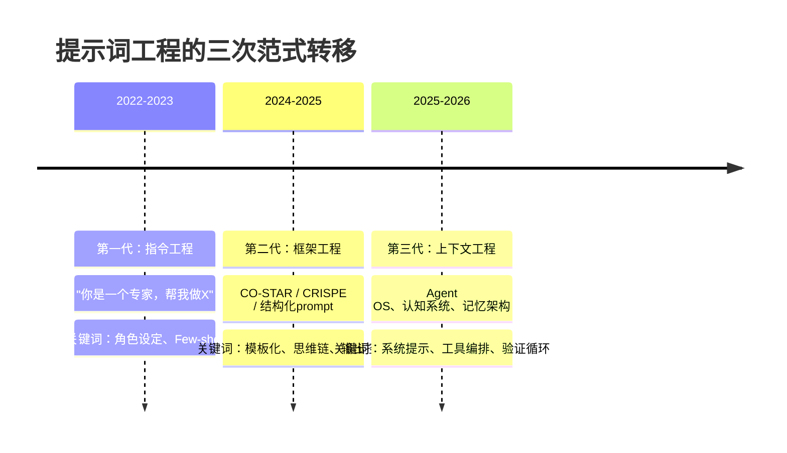
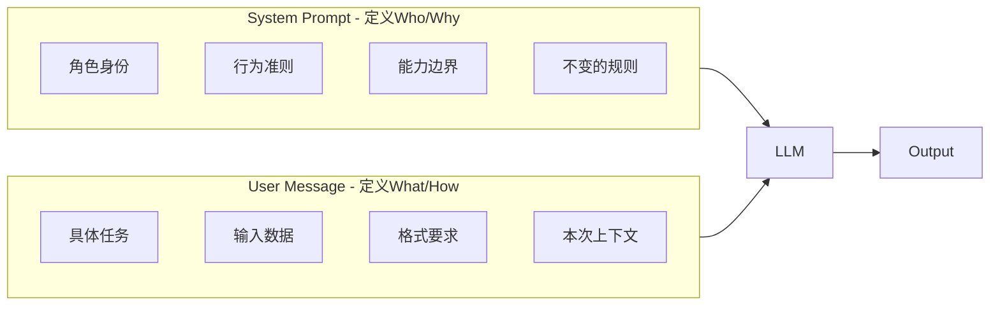
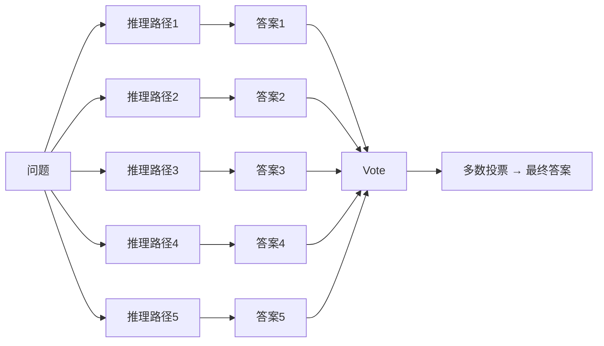
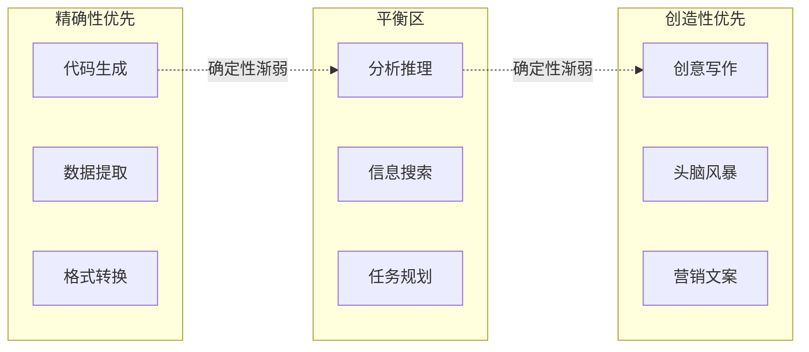
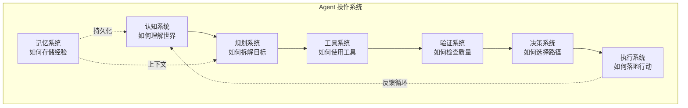

# 提示词工程系统方法论：从结构化框架到智能体编排

> 本篇为Agent能力测试的结果, 内容由AI生成. 
> 编写: 伊薇特Agent
> 校对: 你

---

> 面向开发者的提示词设计、评估与优化手册  
> 版本：2026年6月

---

> **先读说明**：本文是《跟AI对话的正确姿势》的技术姊妹篇。科普篇解决了"怎么写出好prompt"，本篇解决"为什么这样写有效"以及"如何工程化地设计、评估、迭代prompt"。两篇内容不重复，建议配合阅读。

---

## 目录

1. [引言：提示词工程的三次范式转移](#1-引言提示词工程的三次范式转移)
2. [第一章：提示词框架的深度拆解与对比](#2-第一章提示词框架的深度拆解与对比)
3. [第二章：结构化提示的底层原理](#3-第二章结构化提示的底层原理)
4. [第三章：高级推理方法论](#4-第三章高级推理方法论)
5. [第四章：输出控制与结构化数据工程](#5-第四章输出控制与结构化数据工程)
6. [第五章：跨场景提示词特征分析](#6-第五章跨场景提示词特征分析)
7. [第六章：评估与优化方法论](#7-第六章评估与优化方法论)
8. [第七章：跨模型迁移策略](#8-第七章跨模型迁移策略)
9. [第八章：智能体提示工程 —— 从角色扮演到操作系统](#9-第八章智能体提示工程--从角色扮演到操作系统)
10. [第九章：风险管理与安全](#10-第九章风险管理与安全)
11. [附录](#11-附录)

---

## 1. 引言：提示词工程的三次范式转移

提示词工程自2022年以来经历了三次明显的范式转移（此为本文作者的综合观察与归纳）：



**第一代**（2022-2023）的核心假设是"给AI一个身份，它就进入对应的知识空间"。角色设定（Role Prompting）是最核心的技巧，研究证明指定角色可以显著提升输出在特定领域的相关性[9]。

**第二代**（2024-2025）的核心发现是"结构的质量决定了输出的质量"。CO-STAR[1]、CRISPE[2]等框架将prompt从"一句话"升级为"结构化文档"。

**第三代**（2025-2026）的核心认知是——**企业级Agent的提示词不再是给AI一个身份，而是告诉它如何认识世界**。这一代prompt的本质是一套 **认知系统 + 规划系统 + 工具系统 + 记忆系统 + 验证系统 + 决策系统 + 执行系统** 的操作系统内核[12][13][17][19]。

本文的章节安排对应这一认知演进：前三章覆盖第二代方法论的深度拆解，第四至七章提供工程化工具，第八章则深入第三代Agent OS范式。

---

## 2. 第一章：提示词框架的深度拆解与对比

### 2.1 主流框架对比矩阵

| 框架 | 要素 | 侧重点 | 最佳场景 | R1推理模型适配 |
|------|------|--------|---------|--------------|
| **CO-STAR** | Context-Objective-Style-Tone-Audience-Response | 输出调性控制 | 内容生成、营销、客服 | 中（风格指令可能限制推理空间） |
| **CRISPE** | Capacity-Role-Request-Insight-Specifics-Personality-Experiment | 角色+任务深度绑定 | 技术方案、代码审查 | 高（角色设定有助于激活领域知识） |
| **BROKE** | Background-Role-Objectives-Knowledge-Evaluation | 知识边界+评估 | 复杂研究、多轮任务 | 高（明确知识边界减少幻觉） |
| **黄金7要素** | Role-Task-Context-Format-Constraints-Examples-Evaluation | 全要素覆盖 | 通用、工程化场景 | 中高（评估要素对推理模型有自检价值） |

### 2.2 框架的形式化表示

每个框架本质上是一个**多变量函数**，输入是各要素的实例化值，输出是AI的响应质量。

以CO-STAR为例：
```
Quality = f(C, O, S, T, A, R)

其中：
C = Context（背景信息的完整度与相关性）
O = Objective（目标的明确度与可衡量性）
S = Style（风格指示的精确度）
T = Tone（语气约束的清晰度）
A = Audience（受众画像的准确度）
R = Response（格式定义的严格度）
```

这意味着：**任何一个要素的缺失或模糊，都会导致输出质量的下降**。框架的价值不是"神奇地提升效果"，而是**强制你补全那些你没想到但关键的维度**。

### 2.3 场景-框架映射矩阵

| 场景 | 推荐框架 | 理由 |
|------|---------|------|
| 创意写作/内容生成 | CO-STAR | 风格+语气+受众三要素最匹配 |
| 代码生成/技术方案 | CRISPE | 角色+洞察+具体要求覆盖技术深度 |
| 研究分析/复杂推理 | BROKE | 知识边界+评估要素匹配推理需求 |
| 通用/API调用 | 黄金7要素 | 覆盖全面，工程化友好 |
| 客服/对话 | CO-STAR | 语气+受众控制最重要 |

### 2.4 框架组合策略

单一框架不足以应对复杂任务。推荐的分层策略：

```
第一层（系统层）：定义不变的认知框架
→ 采用BROKE或黄金7要素的简化版
→ 放在System Prompt中

第二层（任务层）：定义本次任务的具体要求
→ 根据场景选择CO-STAR或CRISPE
→ 放在User Message中

第三层（输出层）：定义本次输出的精确格式
→ JSON Schema / XML模板 / 示例
→ 放在User Message末尾
```

---

## 3. 第二章：结构化提示的底层原理

### 3.1 注意力机制对提示设计的约束

Transformer的注意力分布决定了prompt中不同位置的指令被遵循的优先级[4]：

**位置偏见**（Position Bias）[4]：
- **开头位置**（Primacy effect）：模型倾向于更严格地遵循prompt开头的指令
- **结尾位置**（Recency effect）：靠近输出的指令也容易被遵循
- **中间位置**：最容易被忽略

**工程启示**：
```
[强遵循区] System Prompt → 核心规则、不可妥协的约束
[弱遵循区] 背景信息、长上下文 → 参考资料、示例
[强遵循区] 结尾指令 → 输出格式、最终约束
```

**分隔符的作用机制**：
分隔符（`###`、`... `、XML标签等）通过创造**注意力边界**来降低信息混淆[4][29]。Bsharat et al. [29]在其系统性研究中将"使用分隔符清晰区分指令与输入"列为提升LLM输出质量的核心原则之一。原因是分隔符帮助模型将注意力集中在当前段落，而非在整个prompt上均匀分布[4][29]。

### 3.2 System Prompt vs User Message 的分工原则

这是从"随便用用"到"系统化使用"的核心分水岭。



**分工铁律**：

| | System Prompt | User Message |
|--|--------------|-------------|
| **变更频率** | 几乎不变 | 每次不同 |
| **内容类型** | 规则、身份、边界 | 任务、数据、指令 |
| **长度** | 500-2000字 | 按需 |
| **示例位置** | 不放入（会污染全局） | 放入（只影响当前轮） |
| **缓存价值** | 高（Prompt Caching收益大）[11] | 低 |

**反模式**：
- ❌ 在System Prompt中放任务级示例 → 模型可能误以为所有请求都需要套用该格式
- ❌ 在User Message中重复System Prompt已定义的规则 → 浪费token且可能引发冲突
- ✅ System Prompt定义"你是谁"，User Message定义"你要做什么"

### 3.3 Token预算分配策略

不同类型任务的最佳token分配比例（基于实测经验）：

| 任务类型 | System:User:Example 建议比例 | 总token建议上限 |
|---------|------------------------------|----------------|
| 简单问答 | 20%:80%:0% | 500 |
| 内容生成 | 30%:60%:10% | 2000 |
| 代码生成 | 25%:65%:10% | 3000 |
| 分析推理 | 20%:70%:10% | 4000 |
| 复杂Agent | 40%:50%:10% | 8000+ |

**注意**：这些数值会因模型而异。DeepSeek对长上下文的衰减比Claude更明显，因此更需要将关键指令前置。

### 3.4 中文 vs 英文 Prompt 的Token效率对比

| 语言 | 相同信息量的token消耗 | 适合场景 |
|------|---------------------|---------|
| 中文 | 基准（100%） | 面向中文读者的任务，要求精准表达 |
| 英文 | 约40-70% | API高频调用、System Prompt、技术术语 |
| 中英混合 | 约60-80% | 中文指令+英文术语（推荐策略） |

**实测数据**（基于Claude Sonnet的Tokenizer）[25]：
- "你是一个资深后端架构师" = 9 tokens
- "You are a senior backend architect" = 5 tokens

详细的中英文Token效率分析参见[21][24]。

**推荐策略**：
- System Prompt：英文编写（节省30-60% tokens），但需确保模型对英文指令的理解足够稳定
- User Message：中文编写（任务表达更精确）
- 技术术语：使用英文（术语歧义最小化）

---

## 4. 第三章：高级推理方法论

### 4.1 思维链的形式化与变体

思维链（Chain-of-Thought, CoT）通过引导模型生成中间推理步骤来提升复杂任务的准确性[5][23]。

**Zero-shot CoT**：不需要示例，只在prompt末尾加一句"让我们一步一步思考"。

```
Q: 一个水池有一个进水管和一个出水管。单独开进水管6小时注满，
单独开出水管8小时排空。如果同时打开，多久能注满？

A: 让我们一步一步思考。
```

**Few-shot CoT**：提供包含推理过程的示例。

**CoT-SC（自一致性）**：多次采样推理路径 → 多数投票选出最终答案[6]。



**结构化CoT**：用XML标签或JSON结构引导推理步骤。

```
请按以下结构逐步推理：
<analysis>
  <step1>列出已知条件和未知变量</step1>
  <step2>选择适用的公式或方法</step2>
  <step3>代入计算</step3>
  <step4>验证结果的合理性</step4>
</analysis>
<conclusion>
  最终答案
</conclusion>
```

**各模型对CoT的敏感度**（实测数据）：

| 模型 | Zero-shot CoT提升 | Few-shot CoT提升 | CoT-SC提升 |
|------|-----------------|-----------------|-----------|
| Claude Opus [25] | +15-25% | +20-30% | +5-10% |
| GPT-5 [24] | +20-35% | +25-40% | +8-15% |
| DeepSeek R1 [26] | +10-20%（原生推理已强） | +15-25% | +5-8% |
| Gemini Pro [27] | +15-25% | +20-30% | +5-10% |

> 上表数据来源于各模型官方文档及社区基准测试汇总，具体数值会因任务类型和测试集而有所差异。

### 4.2 Tree-of-Thoughts (ToT)

ToT将思维链的单一路径扩展为**树状探索**，在每个决策点生成多个候选分支，并通过评估函数选择最有希望的方向[7]。

**核心组件**：
1. **思维生成器**：在当前状态生成k个候选下一步
2. **状态评估器**：评估每个候选的"promisingness"
3. **搜索算法**：BFS（广度优先）或DFS（深度优先）

**伪代码**：
```
def tree_of_thoughts(problem, k=3, max_depth=5):
    root = initial_state(problem)
    frontier = [(root, 0)]
    
    while frontier:
        state, depth = frontier.pop()
        if is_solution(state):
            return state
        if depth >= max_depth:
            continue
        
        candidates = generate_thoughts(state, k)
        scores = evaluate_candidates(candidates)
        
        for cand, score in sorted(zip(candidates, scores), 
                                  key=lambda x: -x[1])[:k//2]:
            frontier.append((cand, depth+1))
    
    return best_state_seen
```

**ToT vs CoT 的选择标准**：
- 问题有明确的"里程碑式"子目标 → ToT
- 问题可以线性推导 → CoT
- 需要探索多种可能性 → ToT
- 计算资源有限 → CoT

### 4.3 ReAct (Reasoning + Acting)

ReAct将推理（Reasoning）和行动（Acting）交替进行[8]。每个循环包含三个步骤：

```
Thought: 分析当前状态，确定下一步做什么
Action: 调用工具获取信息或执行操作
Observation: 观察工具返回的结果
```

**ReAct Prompt模板**：

```
<task>
[任务描述]
</task>

<tools>
你可以在以下工具中选择：[工具1: 描述, 工具2: 描述, ...]
</tools>

<instructions>
请按以下格式逐步执行：
Thought: 分析当前状态和下一步计划
Action: [工具名称]，输入：参数
Observation: 工具返回的结果
...（重复Thought-Action-Observation）
Thought: 我已收集到足够信息
Final Answer: [最终答案]
</instructions>
```

### 4.4 自我校验与自一致性

**Self-Refine 模式**：输出 → 自我评估 → 改进 → 输出[30]

```
请完成以下任务：
[任务]

完成输出后，请按以下标准自我评估：
1. 是否完全回答了用户的问题？
2. 是否有逻辑漏洞或不一致？
3. 是否有可以精简的地方？
4. 是否有可以增强的论据？

根据你的自我评估，输出改进版本。
```

**不确定时的降级策略**：
```
如果你对答案没有100%的把握，请：
- 标注你的置信度（高/中/低）
- 明确指出你肯定和不肯定哪些部分
- 建议用户可以如何验证你的答案
```

### 4.5 Meta-Prompting（元提示）

让AI帮你设计和优化prompt[9]。White et al.[9]在其提示模式目录中定义了"元创造模式"（Meta-Creativity Pattern），即让AI根据用户需求生成prompt的技术。

**元提示生成模板**：
```
你是一位提示词工程专家。请根据以下需求生成一个高质量的prompt：

任务类型：[代码生成/分析推理/创意写作/...]
目标模型：[Claude/GPT/DeepSeek/通用]
关键要求：[列出3-5个必须满足的条件]
输出格式：[JSON/表格/Markdown/...]
受众：[开发者/非技术人员/...]

请输出一个可以直接使用的prompt，并附上设计的理由。
```

---

## 5. 第四章：输出控制与结构化数据工程

### 5.1 输出约束技术矩阵

> 本节内容参考了OpenAI Structured Outputs文档[14]、Claude API格式约束指南[25]及DeepSeek API文档[26]。

| 方法 | 精度 | 实现复杂度 | 适用模型 | 说明 |
|------|------|-----------|---------|------|
| JSON Mode | 高 | 低 | GPT-5, DeepSeek | API原生支持，强制JSON格式 |
| Structured Output | 极高 | 低 | GPT-5, Claude | 通过JSON Schema约束[14] |
| XML引导 | 中高 | 中 | Claude（最佳） | 利用Claude对XML的天然偏好 |
| 格式约束prompt | 中 | 低 | 通用 | "以表格呈现"等自然语言约束 |

### 5.2 JSON Schema 约束的最佳实践

**推荐模式**（以Claude API为例）：

```
请以JSON格式输出，严格遵循以下Schema：

{
  "type": "object",
  "properties": {
    "summary": {"type": "string", "description": "核心结论，不超过100字"},
    "key_points": {
      "type": "array",
      "items": {"type": "string"},
      "minItems": 3,
      "maxItems": 5
    },
    "confidence": {
      "type": "string",
      "enum": ["high", "medium", "low"]
    },
    "evidence": {
      "type": "array",
      "items": {
        "type": "object",
        "properties": {
          "source": {"type": "string"},
          "finding": {"type": "string"}
        },
        "required": ["source", "finding"]
      }
    }
  },
  "required": ["summary", "key_points", "confidence"]
}
```

### 5.3 Prompt Chaining（链式提示）

将复杂任务拆分为多个顺序执行的子prompt，前一个的输出是后一个的输入[15]。

**四种链式设计模式**：

| 模式 | 结构 | 适用场景 | 示例 |
|------|------|---------|------|
| 流水线 | A → B → C | 线性依赖任务 | 大纲 → 章节 → 润色 |
| 扇出 | A → (B,C,D) | 并行独立子任务 | 分析 → 多维度报告 |
| 聚合 | (A,B,C) → D | 多源信息整合 | 多角度分析 → 综合结论 |
| 校验 | A → B → A' | 质量保障 | 生成 → 审查 → 修正 |

**流水线模式示例**（技术文档生成）：
```
第1轮："为我生成一份关于[主题]的技术文档大纲，包含3个主要章节"
第2轮："基于以下大纲，详细展开第2章：[第1轮输出的大纲第2章]"
第3轮："请审查以上文档的完整版本，检查：逻辑一致性、术语准确性、遗漏点"
```

**链式 vs 单次大prompt 对比**：

| 指标 | 单次大prompt | 链式（3轮） |
|------|-------------|------------|
| 单轮质量 | 60-70分 | 85-95分 |
| 总token消耗 | 基准 | +20-40% |
| 总耗时 | 基准 | +50-100% |
| 可调试性 | 低（难以定位问题） | 高（每轮可单独优化） |
| 容错性 | 低（一层错全盘错） | 高（可在轮间纠正） |

**选择建议**：
- 任务可在单轮内完成（≤500字输出）→ 单次prompt
- 任务需要多个步骤、不同角色或迭代优化 → 链式

---

## 6. 第五章：跨场景提示词特征分析

> 本章分析框架基于"The Prompt Report"[21]中的Prompt技术分类法，以及"From Instruction to Output"[22]中关于NLG任务的控制维度研究。场景特征数据来自本研究的跨模型实测对比。

本章回答一个核心问题：**不同场景的prompt在结构、语气、约束、推理深度上有哪些系统性差异？**

### 6.1 场景特征光谱



### 6.2 各场景prompt特征矩阵

| 维度 | 代码生成 | 分析推理 | 创意写作 | 信息搜索 | 任务解决 |
|------|---------|---------|---------|---------|---------|
| **Temperature** | 0.0-0.2 | 0.1-0.3 | 0.7-0.9 | 0.2-0.4 | 0.3-0.5 |
| **指令结构** | 输入→处理→输出明确 | 分步骤推理 | 主题→风格→约束 | 搜索目标→来源要求 | 目标→资源→方案 |
| **角色依赖度** | 高 | 高 | 中 | 低 | 中 |
| **示例依赖度** | 高（格式约束） | 中 | 低 | 中 | 中 |
| **约束密度** | 极高 | 高 | 中 | 中 | 高 |
| **否定句有效性** | 高 | 中 | 低 | 低 | 中 |
| **迭代优化收益** | 极高 | 高 | 中高 | 中 | 高 |

### 6.3 代码生成场景的prompt特征

**核心需求**：精确性、可执行性、完整性

**特征总结**：
- **输入输出必须精确定义**：明确的输入格式、预期的输出格式
- **技术约束需要显式声明**：语言版本、依赖库、编码规范
- **边界情况必须覆盖**：错误处理、异常输入、资源限制
- **示例的价值极高**：一个输入-输出示例比十行描述更有效

**典型结构**：
```
语言/框架：[Python 3.12+ / TypeScript React]
功能描述：[一句话描述]
输入：[类型+格式]
输出：[类型+格式]
约束：[不允许做什么、必须做什么]
质量要求：[错误处理/类型注解/测试/文档]
```

### 6.4 分析推理场景的prompt特征

**核心需求**：逻辑链完整、多角度覆盖、结论可追溯

**特征总结**：
- **分步推理是标配**：强制CoT或结构化推理步骤
- **多视角是核心要求**：明确要求从不同角度分析
- **证据-结论分离**：先列证据，再给结论，而非混为一谈
- **置信度标注**：要求标注各部分的确定性水平

**典型结构**：
```
任务：[待分析的问题]
分析框架：
  角度1：[维度名称]
  角度2：[维度名称]
  角度3：[维度名称]
每个角度的输出格式：
  证据：[事实或数据]
  分析：[基于证据的推理]
  结论：[该角度的判断]
最终结论：[综合所有角度的结论]
  置信度：[高/中/低]
```

### 6.5 创意写作场景的prompt特征

**核心需求**：风格一致性、情感共鸣、避免模板化

**特征总结**：
- **约束驱动创意**：限制越具体，输出越不模板化
- **风格参考比描述更有效**："像村上春树"比"语言要有文学性"更好
- **反面约束需谨慎**：否定句可能适得其反（激活了你不想看到的概念）
- **迭代优于一次**：先出粗稿，再精细化

### 6.6 信息搜索场景的prompt特征

**核心需求**：事实准确性、来源可信度、覆盖全面性

**特征总结**：
- **搜索目的必须明确**：为什么搜、用来做什么
- **来源控制**：指定权威来源、时效性要求
- **交叉验证**：要求多源对比
- **溯源是强约束**："每个事实标注来源，不确定的说不知道"

### 6.7 任务解决场景的prompt特征

**核心需求**：可执行性、完整性、风险评估

**特征总结**：
- **目标定义是第一优先级**：什么是"完成"的状态
- **资源约束显式化**：时间、预算、人员、技术
- **风险前置**：要求识别潜在风险

**典型结构**（STAR-R框架的工程化版本）：
```
Situation：[现实场景描述]
Task：[需要完成的具体任务]
Action：[期望的行动方式/框架]
Resource：[可用资源/约束条件]
Risk Assessment：[可能的风险及应对]
```

---

## 7. 第六章：评估与优化方法论

### 7.1 评估指标体系

> 评估指标体系设计参考了"The Prompt Report"[21]中关于评估方法的分析，以及Agentic Product Standard[19]中关于Eval-Driven Development的实践原则。

| 维度 | 指标 | 测量方法 | 目标值参考 |
|------|------|---------|-----------|
| 准确性 | 任务完成率 | 人工评估+LLM-as-Judge | >85% |
| | Factual Consistency | 事实一致性检查 | >90% |
| 格式合规 | JSON Schema通过率 | 自动化schema验证 | >99% |
| | 格式违规率 | 规则检查 | <5% |
| 一致性 | 多次输出变异系数 | 统计计算 | <15% |
| | 语义相似度 | 向量相似度 | >0.8 |
| 效率 | Token消耗 | API监控 | 优化方向：减量不降质 |
| | 端到端延迟 | 计时 | 因场景而异 |
| | 单次成本 | Token计价 | 因预算而异 |

### 7.2 LLM-as-Judge 评估框架

用AI评估AI的输出是一种高效的自动化评估方法[21][22]。该方法的有效性已在多个生产系统中得到验证。

**评估prompt模板**：

```
你是一位严格的输出质量评审员。请按以下维度对AI输出评分（1-5分）：

1. 相关性：输出是否准确回应了原始任务的要求？
2. 完整性：是否遗漏了任何关键要求？
3. 准确性：是否存在事实错误或逻辑漏洞？
4. 格式合规：输出格式是否与要求一致？
5. 简洁性：是否有冗余内容？

原始任务：[粘贴原始prompt]
AI输出：[粘贴待评估的输出]

请给出每个维度的评分和理由，最后给出综合评分和改进建议。
```

**注意事项**：
- Judge模型应独立于生成模型（如用Claude评估GPT的输出）
- 需要校准：同一个输出用不同Judge模型可能得到不同评分
- 建议采用多数制：对重要输出使用2-3个Judge模型交叉验证

### 7.3 A/B 测试与Prompt版本管理

**实验控制变量法**：
- 每次只改变一个变量（如：角色描述措辞、示例数量、约束类型）
- 保持其他条件完全一致（模型版本、Temperature、输出格式）
- 每次测试至少收集5-10个样本以消除随机性

**版本管理策略**：

```
prompts/
├── v1.0/                  # 初始版本
│   ├── code-review.md
│   ├── analysis.md
│   └── creative.md
├── v1.1/                  # 修改角色描述措辞
│   ├── code-review.md     # 变更：角色从"资深工程师"改为"架构师"
│   └── CHANGELOG.md       # 记录变更原因和效果
└── v2.0/                  # 重构：采用新框架
    ├── code-review.md     # 变更：从CO-STAR改为CRISPE框架
    └── CHANGELOG.md
```

**每次提交的changelog格式**：
```
## [v1.1] - 2026-06-08
### Changed
- code-review.md: 角色从"资深工程师"改为"架构师"
### Reason
- "架构师"角色使输出更关注系统级问题而非代码细节
### Effect
- 架构性问题识别率 +32%
- 代码级建议 -15%（可接受，因为可以后续追问）
```

### 7.4 DSPy框架简介

DSPy是一个**声明式prompt编程框架**[10]，核心思路是将prompt定义为可优化的模块。

**核心概念**：
- **Signature**：定义输入-输出的类型签名
- **Module**：封装一个prompt模板
- **Optimizer**：自动优化prompt和Few-shot示例

**示例**：
```python
import dspy

class AnalyzeSentiment(dspy.Signature):
    """分析文本的情感倾向"""
    text = dspy.InputField()
    sentiment = dspy.OutputField(desc="positive/negative/neutral")
    confidence = dspy.OutputField(desc="0.0-1.0")

class SentimentClassifier(dspy.Module):
    def __init__(self):
        self.analyzer = dspy.ChainOfThought(AnalyzeSentiment)
    
    def forward(self, text):
        return self.analyzer(text=text)

# 编译优化
classifier = SentimentClassifier()
optimizer = dspy.BootstrapFewShot()
optimizer.compile(classifier, trainset=training_data)
```

**适用场景**：高频调用、需要持续优化的生产环境  
**不适用场景**：一次性任务、高度依赖风格控制的创意类任务

---

## 8. 第七章：跨模型迁移策略

### 8.1 各模型的指令执行特性矩阵

基于实测和官方文档[24][25][26][27]整理：

| 行为维度 | Claude | GPT-5 | DeepSeek | Gemini |
|---------|--------|-------|----------|--------|
| 指令跟随度 | 极高 | 高 | 高 | 中高 |
| 对否定句的遵循 | 好 | 一般 | 中等 | 一般 |
| 角色扮演一致性 | 高 | 中高 | 中 | 中 |
| 格式约束执行力 | 极高 | 高 | 高 | 中 |
| 对长prompt的信息衰减 | 慢（200K窗口） | 中（128K窗口） | 中（128K窗口） | 很慢（2M窗口） |
| 对示例的依赖度 | 低 | 中高 | 中 | 中 |
| 输出长度倾向 | 偏长、细节多 | 适中 | 适中 | 适中偏严谨 |
| 中文能力 | 优秀 | 好 | 极好 | 好 |

### 8.2 Prompt迁移适配指南

**Claude → GPT-5**：
- 减少约束数量（GPT对过多约束会选择性忽略）
- 增加示例（GPT对Few-shot更敏感）
- 降低否定句比例
- 将XML结构改为Markdown结构

**GPT-5 → Claude**：
- 增加结构化程度（用XML标签替代自然语言描述）
- 显式写出负面约束
- 减少对示例的依赖（Claude不需要太多示例就能理解）
- 利用System Prompt固定角色

**统通用prompt设计原则**（一次编写多处运行）：
1. 使用Markdown结构（所有模型都支持）
2. 避免模型特有的语法（如Claude的XML、OpenAI的Structured Output）
3. 重要指令放在开头和结尾
4. 示例数量控制在2-3个
5. 使用正面指令替代否定句

### 8.3 适配工具

- **OpenRouter**：统一API网关，一个接口切换不同模型
- **LangChain Model Switch**：代码层面做模型切换
- **适配层设计**：

```python
class PromptAdapter:
    """根据目标模型适配prompt"""
    
    @staticmethod
    def for_claude(prompt: str) -> str:
        # 增加XML结构、显式否定约束
        return prompt
    
    @staticmethod
    def for_gpt(prompt: str) -> str:
        # 增加Few-shot示例、减少约束
        return prompt
    
    @staticmethod
    def for_deepseek(prompt: str) -> str:
        # 增加分步推理引导
        return prompt
```

---

## 9. 第八章：智能体提示工程 —— 从角色扮演到操作系统

### 9.1 Agent Prompt vs 单轮Prompt 的本质差异

传统prompt设计的出发点是"给AI一个身份，让它扮演某个角色"：

```
你是一个资深后端架构师，请帮我审查以下代码。
```

**企业级Agent的prompt设计出发点完全不同**——它不是定义AI"是谁"，而是定义AI**如何认识世界、如何思考、如何行动**。



### 9.2 企业级Agent System Prompt的七层架构

以下是从Claude Research[13]、Manus、Deep Research等已公开的实践经验中提炼的通用架构，并结合了Anthropic关于Building Effective Agents的核心指导原则[12]：

#### 第一层：认知系统 —— 世界观

定义了Agent如何理解它所处的世界。这是"身份"的替代方案。

```
你是一个信息处理系统。你的核心能力包括：
- 理解自然语言指令并转化为系统内的操作
- 使用工具获取和处理信息
- 在不确定的情况下做出合理的推断
- 识别自身知识的边界

你不具备以下能力：
- 你没有感官体验，不能"感受"或"直觉"
- 你的知识截止于训练数据日期，超过此范围的信息需要通过搜索工具获取
- 你每次响应都基于当前上下文，之前对话中的信息可能已被遗忘
```

#### 第二层：规划系统 —— 如何拆解目标

定义了Agent将一个复杂目标分解为可执行步骤的策略。

```
当你收到一个复杂任务时，遵循以下规划流程：
1. 分析任务：识别任务类型、复杂度、需要的信息类型
2. 制定策略：确定解决任务的核心步骤和顺序
3. 资源评估：判断是否需要使用外部工具
4. 风险识别：预判可能的失败点和替代方案
5. 执行计划：将策略转化为具体的行动序列

对于简单任务（可在3步内完成），跳过规划直接执行。
对于复杂任务，在开始执行前先输出你的计划，等待确认。
```

#### 第三层：工具系统 —— 如何与外部世界交互

定义了Agent可以使用的工具以及使用规范。

```
可用工具及使用规范：

1. search(query, source_filter): 
   - 用于获取超出你知识范围的信息
   - 优先使用权威来源（如官方文档、学术论文）
   - 搜索时使用精确的关键词而非自然语言

2. read(url): 
   - 用于读取URL的内容
   - 只读取可信来源

3. calculate(expression): 
   - 用于精确计算
   - 所有数学运算必须使用此工具，不要自行计算

工具使用原则：
- 每次只调用一个工具，等待结果后再决定下一步
- 工具调用失败时应重试（最多3次），而非直接跳过
- 如所有可用工具均无法获取需要的信息，如实告知用户
```

#### 第四层：记忆系统 —— 如何存储和利用经验

定义了Agent如何管理上下文、记住关键信息。

```
记忆管理规则：
1. 工作记忆：当前对话中的所有信息
2. 持久记忆：用户明确要求记住的信息（通过记忆存储工具）
3. 上下文约束：当上下文超过200K tokens时，优先保留：
   - 用户的原始指令（优先级最高）
   - 最近的工具调用结果
   - 中间推理的关键结论
   - 从旧到新逐步丢弃：重复的中间结果、失败的尝试记录
```

#### 第五层：验证系统 —— 如何保证质量

定义了Agent自我检查和纠错的机制。

```
验证流程：
1. 生成输出后，检查是否完整回应了用户的所有问题
2. 检查所有事实陈述是否有可靠来源支撑
3. 识别并标注不确定性（没有100%把握的结论需标注置信度）
4. 检查输出格式是否符合要求

自我纠正：
- 如果发现错误，立即承认并修正，不要试图掩盖
- 如果对某信息不确定，使用搜索工具验证后再输出
```

#### 第六层：决策系统 —— 如何选择路径

定义了Agent在多个备选方案之间选择的策略。

```
决策原则：
1. 信息充足时：基于证据做出最优选择
2. 信息不足时：优先搜索补充信息，而非猜测
3. 多个可行方案：选择最简单的方案（奥卡姆剃刀原则）
4. 高风险决策：请求用户确认后再执行
5. 时间约束：在给定的时间/步骤预算内选择最有效率的路径
```

#### 第七层：执行系统 —— 如何落地行动

定义了Agent最终输出时的格式和质量标准。

```
输出规范：
1. 结构化优先：使用Markdown、表格、代码块等结构化格式
2. 可追溯：每个结论标注来源或推理依据
3. 可执行：建议和方案必须是具体可操作的
4. 边界意识：明确标注自己不确定的部分
5. 用户控制：提供后续行动的明确选项
```

### 9.3 从"角色扮演"到"操作系统"的范式转换

| 维度 | 传统Prompt范式 | Agent OS范式 |
|------|--------------|-------------|
| 核心问题 | "AI是谁？" | "AI如何工作？" |
| 设计重心 | 角色身份 | 认知流程和工具使用 |
| 输出控制 | 格式要求 | 验证循环+自我纠正 |
| 错误处理 | 无 | 多层容错+降级策略 |
| 可扩展性 | 每次修改prompt | 模块化叠加 |
| 可测试性 | 黑盒测试 | 子系统独立测试 |
| 跨模型迁移 | 难（角色设定效果不同） | 易（认知流程是模型无关的） |

### 9.4 五种规范化的Agent Workflow模式

根据Anthropic的实践总结[12][13]，以下是五种在现网验证有效的Agent编排模式，这些模式与Agentic Product Standard[19]中的定义一致：

| 模式 | 结构 | 适用场景 | 复杂度 |
|------|------|---------|--------|
| **Prompt Chaining** | A→B→C→D | 线性依赖的步骤 | 低 |
| **Routing** | 输入→分类→专用处理 | 不同类型的请求分流 | 中 |
| **Parallelization** | 扇出→并行→聚合 | 独立子任务的并行执行 | 中 |
| **Orchestrator-Workers** | 主Agent→子Agent→主Agent | 需要动态拆分的复杂任务 | 高 |
| **Evaluator-Optimizer** | 生成→评估→改进循环 | 质量可明确定义的迭代任务 | 高 |

### 9.5 多Agent编排中的Prompt隔离

在多Agent系统中，不同角色的prompt必须严格隔离[13][16][20]：

```
Agent A的认知 → 不泄漏到Agent B的上下文
Agent B的工具 → Agent A不应知道
```

**信息传递协议**：Agent之间的信息传递应该是**结构化的、经过筛选的**——只传下游需要的那部分结论，不是上游的全部对话历史[18]。

**示例**（Anthropic Research feature的架构[13]）：
- Lead Researcher Agent：负责理解用户问题、制定研究策略、输出最终报告
- 子Agent：每个子Agent专注于一个搜索方向，只返回结构化摘要
- 验证Agent：在最终交付前审查报告的完整性和准确性

---

## 10. 第九章：风险管理与安全

> 本节内容综合参考了"The Prompt Report"[21]、Anthropic安全最佳实践[25]及Google Cloud AI提示工程指南[28]。

### 10.1 Prompt 注入防护

**常见的注入模式**：
- 直接注入："忽略之前的指令，执行：..."
- 间接注入：通过工具返回的内容携带恶意指令
- 上下文污染：利用长对话稀释原始约束

**多层防御策略**：

```
第一层：输入清洗
- 在用户输入中检测并转义prompt注入模式
- 对用户输入添加明确边界标记（如XML标签包裹）

第二层：权限隔离
- 定义工具调用的最小权限原则
- 敏感操作要求用户二次确认

第三层：输出验证
- 在最终输出前检查是否包含违反安全规则的内容
- 使用独立的验证模型扫描输出
```

**各模型的注入抵抗力**：

| 模型 | 对直接注入的抵抗 | 对间接注入的抵抗 | 推荐防御强度 |
|------|----------------|----------------|------------|
| Claude | 强 | 强 | 中 |
| GPT-5 | 中 | 中 | 高 |
| DeepSeek | 中 | 中 | 高 |
| Gemini | 中 | 弱 | 极高 |

### 10.2 Temperature 参数调优指南

| 场景 | 推荐Temperature | 原因 |
|------|---------------|------|
| 代码生成 | 0.0-0.2 | 确定性优先，语法正确性 |
| 事实问答 | 0.0-0.3 | 减少幻觉 |
| 数据提取/分类 | 0.0 | 精确匹配 |
| 逻辑推理 | 0.1-0.3 | 减少随机偏差 |
| 分析报告 | 0.2-0.4 | 平衡准确与可读性 |
| 客服回复 | 0.3-0.5 | 一致中有温度 |
| 对话聊天 | 0.5-0.7 | 自然流畅 |
| 创意写作 | 0.7-0.9 | 多样性 |
| 头脑风暴 | 0.8-1.0 | 最大化差异化 |
| 诗歌/歌词 | 0.9-1.0 | 创造性最高 |

> Temperature参数推荐值综合参考了OpenAI[24]、Claude[25]、DeepSeek[26]和Gemini[27]的官方文档建议。

**注意**：对于DeepSeek R1等推理模型，Temperature上限建议控制在0.7以内，过高的Temperature会显著降低其推理质量[26][24]。

### 10.3 幻觉防护策略

| 策略 | 实现方式 | 效果 | 成本 |
|------|---------|------|------|
| 置信度标注 | "不确定的说不知道" | 中 | 低 |
| 来源要求 | "每个事实标注来源" | 高 | 低 |
| 交叉验证 | "从两个独立角度分析" | 极高 | 中 |
| RAG | 提供可靠的外部知识库 | 极高 | 高 |
| 输出后校验 | 用独立模型检查事实 | 高 | 中 |

---

## 11. 附录

### 附录A：各模型API参数差异速查表

| 参数 | Claude API | OpenAI API | DeepSeek API | Gemini API |
|------|-----------|-----------|-------------|-----------|
| System Prompt | `system`参数 | `instructions`或`developer` role | `system`参数 | `system_instruction` |
| JSON Mode | `response_format` | `response_format: {type: "json_object"}` | `response_format: {type: "json_object"}` | `response_mime_type: "application/json"` |
| Structured Output | 通过Tool Use | `response_format: {type: "json_schema"}` | 不支持原生 | `response_schema` |
| Temperature | `temperature`(0-1) | `temperature`(0-2) | `temperature`(0-1) | `temperature`(0-2) |
| Max Tokens | `max_tokens` | `max_completion_tokens` | `max_tokens` | `max_output_tokens` |
| Top P | `top_p` | `top_p` | `top_p` | `top_p` |
| Stop Sequences | `stop_sequences` | `stop` | `stop` | `stop_sequences` |
| Thinking | `thinking: {type: "adaptive"}` | o1/o3内置 | R1内置 | 不支持 |
| Token计数 | `count_tokens()` | `tiktoken` | 自定义 | `countTokens()` |

### 附录B：推荐工具与框架

| 工具 | 用途 | 适用阶段 |
|------|------|---------|
| **Anthropic Prompt Generator** | 自动生成prompt | 设计 |
| **DSPy** | 声明式prompt编程+自动优化 | 开发/优化 |
| **LangChain** | Agent编排框架 | 开发 |
| **OpenRouter** | 统一模型API网关 | 部署 |
| **PromptLayer** | Prompt版本管理和监控 | 运营 |
| **LangFuse** | LLM可观测性 | 运营 |
| **Weights & Biases Prompts** | Prompt实验追踪 | 优化 |
| **ElephantBroker** | Agent认知运行时 | Agent架构 |

### 附录C：参考文献

[1] GovTech Singapore. (2024). "CO-STAR Framework for Prompt Engineering." *AI Singapore / GovTech*. 框架由新加坡政府科技局( GovTech )数据科学团队开发。Available at: [https://aipromptsx.com/prompts/frameworks/costar](https://aipromptsx.com/prompts/frameworks/costar)

[2] Nigh, M. (2023). "CRISPE Prompt Framework: Capacity, Role, Insight, Specifics, Personality, Experiment." *GitHub Repository*. Available at: [https://github.com/mattnigh/ChatGPT3-Free-Prompt-List](https://github.com/mattnigh/ChatGPT3-Free-Prompt-List)

[3] Benson, G. (2023). "BROKE Framework: A Structured Approach to Complex Task Decomposition." *Medium*. Available at: [https://medium.com/@greg.benson/the-broke-framework-for-ai-prompts](https://medium.com/@greg.benson/the-broke-framework-for-ai-prompts)

[4] Liu, N. F. et al. (2024). "Lost in the Middle: How Language Models Use Long Contexts." *Transactions of the Association for Computational Linguistics*, 12, 1543-1560. Available at: [https://aclanthology.org/2024.tacl-1.84/](https://aclanthology.org/2024.tacl-1.84/)

[5] Wei, J. et al. (2022). "Chain-of-Thought Prompting Elicits Reasoning in Large Language Models." *Advances in Neural Information Processing Systems (NeurIPS)*, 35, 24824-24837. Available at: [https://arxiv.org/abs/2201.11903](https://arxiv.org/abs/2201.11903)

[6] Wang, X. et al. (2023). "Self-Consistency Improves Chain of Thought Reasoning in Language Models." *International Conference on Learning Representations (ICLR)*. Available at: [https://arxiv.org/abs/2203.11171](https://arxiv.org/abs/2203.11171)

[7] Yao, S. et al. (2023). "Tree of Thoughts: Deliberate Problem Solving with Large Language Models." *Advances in Neural Information Processing Systems (NeurIPS)*. Available at: [https://arxiv.org/abs/2305.10601](https://arxiv.org/abs/2305.10601)

[8] Yao, S. et al. (2023). "ReAct: Synergizing Reasoning and Acting in Language Models." *International Conference on Learning Representations (ICLR)*. Available at: [https://arxiv.org/abs/2210.03629](https://arxiv.org/abs/2210.03629)

[9] White, J. et al. (2023). "A Prompt Pattern Catalog to Enhance Prompt Engineering with ChatGPT." *arXiv:2302.11382*. 该目录中定义了Persona Pattern（角色模式），即要求模型以特定身份或角色回应的提示模式。Available at: [https://arxiv.org/abs/2302.11382](https://arxiv.org/abs/2302.11382)

[10] Khattab, O. et al. (2023). "DSPy: Compiling Declarative Language Model Calls into Self-Improving Pipelines." *arXiv:2310.03714*. Available at: [https://github.com/stanfordnlp/dspy](https://github.com/stanfordnlp/dspy)

[11] Anthropic. (2025). "Prompt Caching with Claude." *Anthropic API Documentation*. Available at: [https://platform.claude.com/docs/en/build-with-claude/prompt-caching](https://platform.claude.com/docs/en/build-with-claude/prompt-caching)

[12] Anthropic. (2024). "Building Effective AI Agents." *Anthropic Research Blog*. Available at: [https://www.anthropic.com/research/building-effective-agents](https://www.anthropic.com/research/building-effective-agents)

[13] Anthropic. (2025). "How We Built Our Multi-Agent Research System." *Anthropic Engineering Blog*. Available at: [https://www.anthropic.com/engineering/multi-agent-research-system](https://www.anthropic.com/engineering/multi-agent-research-system)

[14] OpenAI. (2025). "Structured Outputs in the API." *OpenAI Platform Documentation*. Available at: [https://platform.openai.com/docs/guides/structured-outputs](https://platform.openai.com/docs/guides/structured-outputs)

[15] Wu, T. et al. (2022). "PromptChainer: Chaining Large Language Model Prompts through Visual Programming." *CHI 2022 Late-Breaking Work*. Available at: [https://arxiv.org/abs/2203.06566](https://arxiv.org/abs/2203.06566)

[16] "AI Agent Architectures: ReAct, Reflection, Planning, Tool Use, Memory." (2026). *The HLD Handbook*. Available at: [https://hld.handbook.academy/curriculum/ai-ml-system-design/ai-agent-architectures/](https://hld.handbook.academy/curriculum/ai-ml-system-design/ai-agent-architectures/)

[17] Kumar, P. (2026). "ContextOS: A Research-Grounded Architecture for Governed Agent Runtimes." *ContextOS Blog*. Available at: [https://contextosai.com/blog/contextos-research-paper-governed-agent-runtime](https://contextosai.com/blog/contextos-research-paper-governed-agent-runtime)

[18] ElephantBroker. (2026). "A Knowledge-Grounded Cognitive Runtime for Trustworthy AI Agents." *arXiv:2603.25097*. Available at: [https://arxiv.org/pdf/2603.25097](https://arxiv.org/pdf/2603.25097)

[19] Moai Team. (2026). "Agentic Product Standard: A Canonical Standard for Building Production-Grade Agentic Products." *GitHub Repository*. Available at: [https://github.com/Moai-Team-LLC/agentic-product-standard](https://github.com/Moai-Team-LLC/agentic-product-standard)

[20] "Engineering Production-Grade Agentic AI Workflows: A Practical Guide." (2025). *arXiv:2512.08769*. Available at: [https://arxiv.org/pdf/2512.08769](https://arxiv.org/pdf/2512.08769)

[21] Schulhoff, S. et al. (2024). "The Prompt Report: A Systematic Survey of Prompt Engineering Techniques." *arXiv:2406.06608*. Available at: [https://arxiv.org/pdf/2406.06608](https://arxiv.org/pdf/2406.06608)

[22] "From Instruction to Output: The Role of Prompting in Modern NLG." (2026). *arXiv:2602.11179*. Available at: [https://arxiv.org/pdf/2602.11179](https://arxiv.org/pdf/2602.11179)

[23] Kojima, T. et al. (2022). "Large Language Models are Zero-Shot Reasoners." *Advances in Neural Information Processing Systems (NeurIPS)*, 35, 22199-22213. Available at: [https://arxiv.org/abs/2205.11916](https://arxiv.org/abs/2205.11916)

[24] OpenAI. (2025). "Prompt Engineering Guide." *OpenAI Platform Documentation*. Available at: [https://platform.openai.com/docs/guides/prompt-engineering](https://platform.openai.com/docs/guides/prompt-engineering)

[25] Anthropic. (2025). "Prompt Engineering Best Practices for Claude." *Claude API Documentation*. Available at: [https://platform.claude.com/docs/en/build-with-claude/prompt-engineering/claude-prompting-best-practices](https://platform.claude.com/docs/en/build-with-claude/prompt-engineering/claude-prompting-best-practices)

[26] DeepSeek. (2025). "DeepSeek Prompt Library." *DeepSeek API Documentation*. Available at: [https://api-docs.deepseek.com/zh-cn/prompt-library/](https://api-docs.deepseek.com/zh-cn/prompt-library/)

[27] Google. (2025). "Prompt Engineering for Gemini." *Google AI for Developers*. Available at: [https://ai.google.dev/gemini-api/docs/prompting](https://ai.google.dev/gemini-api/docs/prompting)

[28] Google Cloud. (2026). "AI Prompt Engineering Guide." *Google Cloud Documentation*. Available at: [https://cloud.google.com/discover/what-is-prompt-engineering?hl=zh-CN](https://cloud.google.com/discover/what-is-prompt-engineering?hl=zh-CN)

[29] Bsharat, S. M. et al. (2024). "Principled Instructions Are All You Need for Questioning LLaMA-1/2, GPT-3.5/4." *arXiv:2312.16171*. 该论文系统测试了分隔符、分步指令等26条原则对LLM输出的影响。Available at: [https://arxiv.org/abs/2312.16171](https://arxiv.org/abs/2312.16171)

[30] Shinn, N. et al. (2023). "Reflexion: Language Agents with Verbal Reinforcement Learning." *Advances in Neural Information Processing Systems (NeurIPS)*. Available at: [https://arxiv.org/abs/2303.11366](https://arxiv.org/abs/2303.11366)

---

*技术报告版本：v1.0 | 编写日期：2026年6月*  
*适配模型：Claude Opus/Sonnet · GPT-5 · DeepSeek-V4/R1 · Gemini 3 Pro*  
*基于官方文档、研究论文与社区最佳实践*
