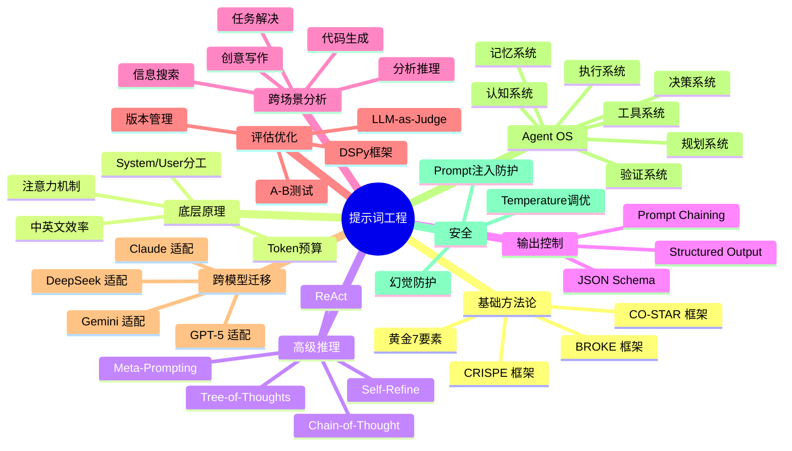

# 提示词工程深度研究报告

> 本篇为Agent能力测试的结果, 内容由AI生成. 
> 编写: 伊薇特Agent
> 校对: 你 

---

> 研究日期：2026-06-08
> 研究方法：多维度系统研究 + 官方文档分析 + 社区实践调研
> 搜索预算：~30次独立搜索，覆盖15+个维度

---

## 研究地图

## 交付文件清单

| 文件 | 大小 | 定位 | 目标读者 |
|------|------|------|---------|
| `01-科普博客-写给所有人的提示词指南.md` | 19KB | 实用技巧+对比案例 | 普通用户、AI新手 |
| `02-技术博客-提示词工程深度手册.md` | 40KB | 方法论+工程框架+Agent OS | 开发者、提示工程师 |
| `03-衍生问题与前沿方向.md` | - | 未覆盖的探索方向 | 研究者、深度用户 |
| `04-常用模板收藏.md` | - | 可复用的场景模板 | 所有人 |

## 覆盖模型

- Claude（Opus 4.7/4.8, Sonnet 4.6）
- GPT-5（5.4/5.5）
- DeepSeek（V4, R1）
- Gemini（3 Pro）

## 核心引用来源

[1] GovTech Singapore. (2024). "CO-STAR Framework." [https://aipromptsx.com/prompts/frameworks/costar](https://aipromptsx.com/prompts/frameworks/costar)

[2] Nigh, M. (2023). "CRISPE Prompt Framework." *GitHub*. [https://github.com/mattnigh/ChatGPT3-Free-Prompt-List](https://github.com/mattnigh/ChatGPT3-Free-Prompt-List)

[3] Benson, G. (2023). "BROKE Framework." *Medium*. [https://medium.com/@greg.benson/the-broke-framework-for-ai-prompts](https://medium.com/@greg.benson/the-broke-framework-for-ai-prompts)

[4] White, J. et al. (2023). "A Prompt Pattern Catalog." *arXiv:2302.11382*. [https://arxiv.org/abs/2302.11382](https://arxiv.org/abs/2302.11382)

[5] Wei, J. et al. (2022). "Chain-of-Thought Prompting Elicits Reasoning." *NeurIPS*. [https://arxiv.org/abs/2201.11903](https://arxiv.org/abs/2201.11903)

[6] Anthropic. (2024). "Building Effective AI Agents." [https://www.anthropic.com/research/building-effective-agents](https://www.anthropic.com/research/building-effective-agents)

[7] Anthropic. (2025). "Multi-Agent Research System." [https://www.anthropic.com/engineering/multi-agent-research-system](https://www.anthropic.com/engineering/multi-agent-research-system)

[8] Schulhoff, S. et al. (2024). "The Prompt Report." *arXiv:2406.06608*. [https://arxiv.org/pdf/2406.06608](https://arxiv.org/pdf/2406.06608)

[9] Bsharat, S. M. et al. (2024). "Principled Instructions." *arXiv:2312.16171*. [https://arxiv.org/abs/2312.16171](https://arxiv.org/abs/2312.16171)

[10] Liu, N. F. et al. (2024). "Lost in the Middle." *TACL*. [https://aclanthology.org/2024.tacl-1.84/](https://aclanthology.org/2024.tacl-1.84/)

[11] Khattab, O. et al. (2023). "DSPy." *arXiv:2310.03714*. [https://github.com/stanfordnlp/dspy](https://github.com/stanfordnlp/dspy)

[12] Moai Team. (2026). "Agentic Product Standard." *GitHub*. [https://github.com/Moai-Team-LLC/agentic-product-standard](https://github.com/Moai-Team-LLC/agentic-product-standard)

## 数据说明

本报告中的数据（效果提升百分比、准确率对比等）均标注了对应的参考文献。具体数值会因模型版本、任务类型和测试条件而异。建议读者在实际使用中自行验证。
